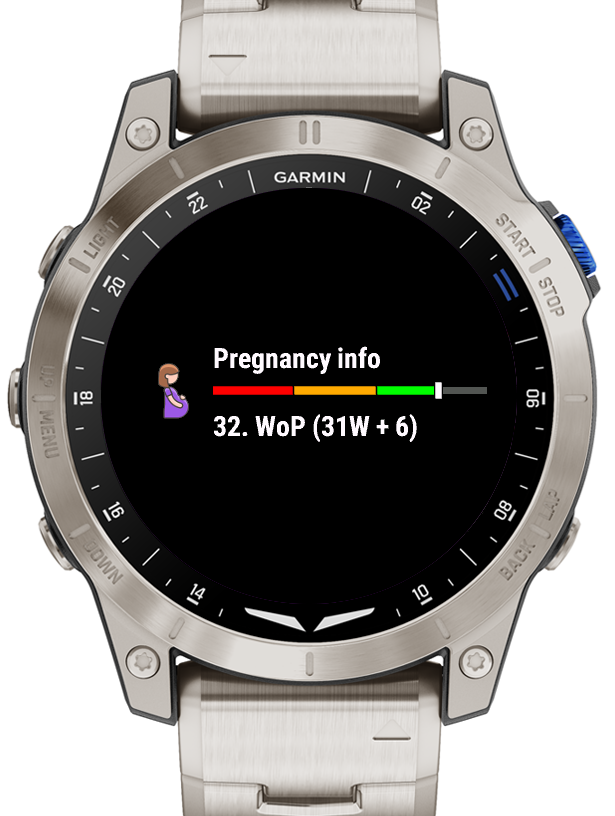

## Pregnancy Widget for Garmin Watches

Shows the current week of pregnancy and trimester.

 

## Current functionality

- Set the date inside the widget menu
- Glance view
- Information about current weight and size

---------
## Sources

Size and weight: https://www.babelli.de/entwicklung-embryo/

##
Connect IQ Store:
https://apps.garmin.com/de-DE/apps/35876c51-1fcb-4781-88b4-0130060010dc

## Supported devices

<table>
  <thead>
    <tr>
      <th>Device</th>
      <th></th>
    </tr>
  </thead>
  <tbody>
    <tr>
      <td>Captain Marvel</td>
      <td>X</td>
    </tr>
    <tr>
      <td>D2™ Air X10</td>
      <td>X</td>
    </tr>
    <tr>
      <td>D2™ Mach 1</td>
      <td>X</td>
    </tr>
    <tr>
      <td>Darth Vader™</td>
      <td>X</td>
    </tr>
    <tr>
      <td>epix™ (Gen 2)</td>
      <td>X</td>
    </tr>
    <tr>
      <td>fēnix® 6</td>
      <td>X</td>
    </tr>
    <tr>
      <td>fēnix® 6 Pro</td>
      <td>X</td>
    </tr>
    <tr>
      <td>fēnix® 6S</td>
      <td>X</td>
    </tr>
    <tr>
      <td>fēnix® 6S Pro</td>
      <td>X</td>
    </tr>
    <tr>
      <td>fēnix® 6X Pro</td>
      <td>X</td>
    </tr>
    <tr>
      <td>fēnix® 7</td>
      <td>X</td>
    </tr>
    <tr>
      <td>fēnix® 7S</td>
      <td>X</td>
    </tr>
    <tr>
      <td>fēnix® 7X</td>
      <td>X</td>
    </tr>
    <tr>
      <td>Forerunner® 245</td>
      <td>X</td>
    </tr>
    <tr>
      <td>Forerunner® 255</td>
      <td>X</td>
    </tr>
    <tr>
      <td>Forerunner® 255s</td>
      <td>X</td>
    </tr>
    <tr>
      <td>Forerunner® 265s</td>
      <td>X</td>
    </tr>
    <tr>
      <td>Forerunner® 265</td>
      <td>X</td>
    </tr>
    <tr>
      <td>Forerunner® 745</td>
      <td>X</td>
    </tr>
    <tr>
      <td>Forerunner® 945</td>
      <td>X</td>
    </tr>
    <tr>
      <td>Forerunner® 955</td>
      <td>X</td>
    </tr>
       <tr>
      <td>Forerunner® 965</td>
      <td>X</td>
    </tr>
    <tr>
      <td>MARQ® (Gen 2)</td>
      <td>X</td>
    </tr>
    <tr>
      <td>MARQ®</td>
      <td>X</td>
    </tr>
    <tr>
      <td>Rey™</td>
      <td>X</td>
    </tr>
    <tr>
      <td>Venu®</td>
      <td>X</td>
    </tr>
    <tr>
      <td>Venu® 2 Plus</td>
      <td>X</td>
    </tr>
    <tr>
      <td>Venu® 2</td>
      <td>X</td>
    </tr>
    <tr>
      <td>Venu® 2s</td>
      <td>X</td>
    </tr>
    <tr>
      <td>vívoactive® 4</td>
      <td>X</td>
    </tr>
    <tr>
      <td>vívoactive® 4S</td>
      <td>X</td>
    </tr>
  </tbody>
</table>

