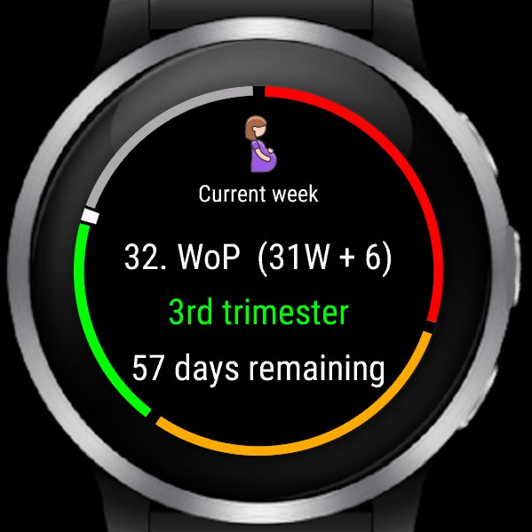

## Pregnancy Widget for Garmin Watches

Shows the current week of pregnancy and trimester.

 

## Current functionality

- Set the date inside the widget menu
- Glance view
- Information about current weight and size

---------
## Sources

Size and weight: https://www.babelli.de/entwicklung-embryo/

##
Connect IQ Store:
https://apps.garmin.com/de-DE/apps/35876c51-1fcb-4781-88b4-0130060010dc

## Supported devices

- Approach S70
- Captain Marvel
- D2™ Air X10
- D2™ Mach 1
- Darth Vader™
- Enduro 3™
- epix™ (Gen 2)
- fēnix® 6 Pro
- fēnix® 7
- fēnix® 8
- fēnix® E
- Forerunner® 165
- Forerunner® 255
- Forerunner® 265
- Forerunner® 745
- Forerunner® 945
- Forerunner® 955
- Forerunner® 965
- Forerunner® 970
- MARQ®
- Rey™
- Venu®
- Venu® 2 Plus
- Venu® 2
- Venu® 2s
- Venu® 3
- Venu® 3s
- vívoactive® 4
- vívoactive® 5
- vívoactive® 6

